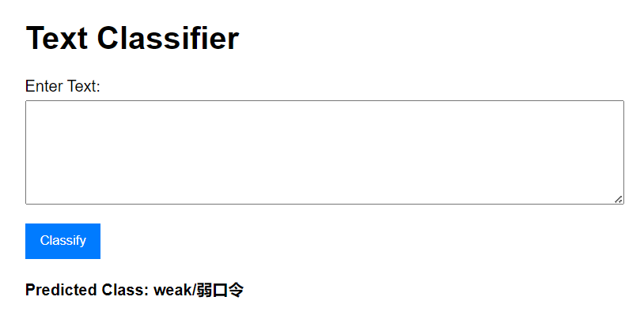

# 基于AI的敏感信息检测

## **分类目标**

- 1 **弱口令**：通常是简单且容易破解的密码，例如“123456”、“password”等。
- 2 **Token**：指的是令牌（Token），例如API访问令牌、OAuth令牌等，通常包含字母、数字和符号。
- 0 **普通文本**：指的是一般的文本内容，例如新闻、文章、聊天记录等。

##  **实验记录**

### 机器学习

模型选择：逻辑回归、高斯、svm、mlp

高斯贝叶斯+TF-IDF：测试集上的评价指标如下，是目前最好的结果

```
准确率：0.6569200779727096
分类报告：
              precision    recall  f1-score   support

           0       0.97      0.09      0.17       358
           1       0.47      1.00      0.64       313
           2       1.00      0.93      0.96       355

    accuracy                           0.66      1026
   macro avg       0.81      0.67      0.59      1026
weighted avg       0.83      0.66      0.59      1026
```


## 示例流程

1. **输入文本**：用户输入一段文本。
2. **预处理**：清洗文本，分词，提取特征。
3. **模型预测**：通过训练好的模型进行分类。
4. **输出结果**：返回弱口令、Token或普通文本的分类结果。


